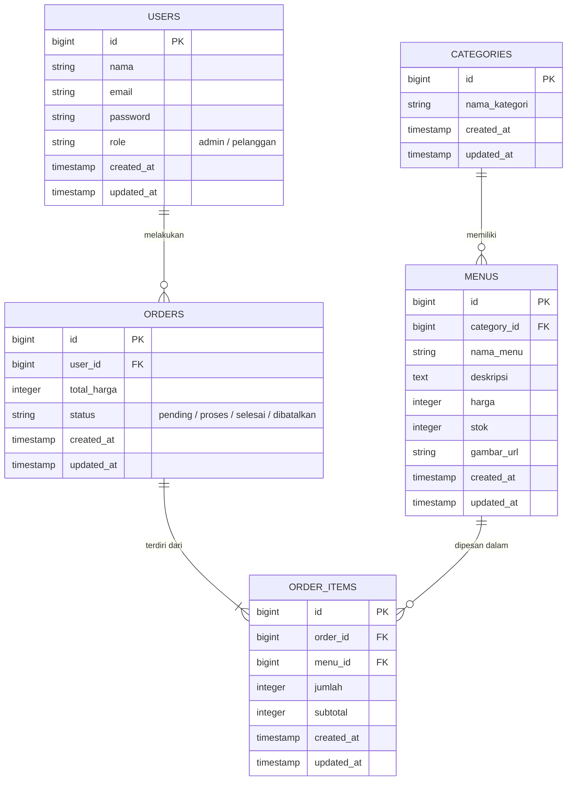

# 🍽️ SiKantin — Sistem Informasi Pemesanan Kantin

SiKantin adalah aplikasi berbasis web yang dirancang untuk memudahkan proses pemesanan makanan dan minuman di kantin. Aplikasi ini memiliki dua peran utama: **Admin** untuk mengelola menu dan pesanan, serta **Pelanggan** untuk melihat menu dan melakukan pemesanan.

---

## ✨ Fitur Aplikasi

### Role Admin
- **Dashboard Statistik**: Memantau total pesanan, pendapatan, menu terlaris, dan pelanggan baru.
- **Manajemen Kategori**: Menambah, mengedit, dan menghapus kategori menu (CRUD).
- **Manajemen Menu**: Mengelola daftar menu beserta detail harga, stok, dan upload gambar.
- **Manajemen Pesanan**: Melihat seluruh riwayat pesanan yang masuk dan memperbarui status pesanan dari pelanggan.

### Role Pelanggan
- **Autentikasi**: Register akun dan Login.
- **Katalog Menu**: Melihat daftar menu makanan & minuman yang dikelompokkan berdasarkan kategori.
- **Pemesanan**: Membuat pesanan baru berdasarkan menu yang tersedia.
- **Riwayat & Status**: Memantau status pesanan secara real-time (pending, proses, selesai, dibatalkan) dan melihat riwayat transaksi sebelumnya.

---

## 🛠️ Teknologi yang Digunakan

Aplikasi ini dibangun menggunakan *tech stack* modern, dengan detail sebagai berikut:

| Komponen | Teknologi |
|---|---|
| **Backend Framework** | Laravel 13 |
| **Database** | MySQL |
| **Frontend Styling** | Tailwind CSS / Bootstrap 5 |
| **Template Engine** | Laravel Blade |
| **API Auth** | Laravel Sanctum |
| **Image Storage** | Cloudinary (via SDK) |
| **Asset Bundler** | Vite |

---

## 🏗️ Arsitektur Aplikasi & Struktur Folder

Aplikasi ini menerapkan pola arsitektur **MVC (Model-View-Controller)** bawaan dari framework Laravel, dengan pemisahan tanggung jawab yang jelas:
- **Model**: Bertanggung jawab merepresentasikan struktur tabel database dan mengatur relasi antar entitas.
- **View**: Menampilkan antarmuka pengguna (UI) kepada *end-user* menggunakan Laravel Blade.
- **Controller**: Menangani logika bisnis utama, memproses *request* dari pengguna, dan memberikan *response* kembali (HTML untuk web, JSON untuk API).

**Struktur Direktori Utama:**
```text
SiKantin/
├── app/
│   ├── Http/
│   │   ├── Controllers/          ← Menampung logic bisnis (Controller Web & API)
│   │   └── Middleware/           ← Pengecekan role (Admin/Pelanggan) dan Autentikasi
│   └── Models/                   ← Model Eloquent untuk berinteraksi dengan database
├── database/
│   ├── migrations/               ← Skema tabel database (DDL)
│   └── seeders/                  ← Data default awal (kategori, menu, akun testing)
├── resources/
│   └── views/                    ← Berisi file-file Blade template untuk UI
├── public/                       ← Tempat penyimpanan aset statis yang dapat diakses publik (CSS, JS, Gambar)
└── routes/
    ├── api.php                   ← Mendefinisikan rute/endpoint REST API
    └── web.php                   ← Mendefinisikan rute untuk halaman web
```

---

## 🗄️ Entity Relationship Diagram (ERD)

Struktur tabel dalam database `sikantin` dirancang saling berelasi untuk mendukung integritas data pemesanan.



---

## 🚀 Cara Menjalankan Project (Local Setup)

Untuk menjalankan aplikasi ini di environment lokal Anda, ikuti langkah-langkah berikut:

1. **Clone Repository**
   ```bash
   git clone https://github.com/muh-ghazii/SiKantin.git
   cd SiKantin
   ```

2. **Install Dependencies**
   Jalankan perintah berikut untuk mengunduh package PHP dan Node.js yang dibutuhkan.
   ```bash
   composer install
   npm install
   ```

3. **Setup Environment**
   Salin file konfigurasi *environment* dan hasilkan *application key* baru.
   ```bash
   cp .env.example .env
   php artisan key:generate
   ```
   *Buka file `.env` dan pastikan kredensial database sudah sesuai dengan server MySQL lokal Anda (`DB_DATABASE`, `DB_USERNAME`, `DB_PASSWORD`, dan `DB_PORT`).*

4. **Jalankan Migrasi & Seeder Database**
   Perintah ini akan membuat semua tabel yang dibutuhkan dan mengisi database dengan data *dummy*.
   ```bash
   php artisan migrate:fresh --seed
   ```

5. **Jalankan Development Server**
   Jalankan server PHP dan Vite secara bersamaan.
   ```bash
   php artisan serve
   npm run dev
   ```
   Aplikasi dapat diakses melalui browser pada alamat `http://127.0.0.1:8000`.

### 🔑 Akun Testing Default
- **Admin**: `admin@sikantin.com` | Password: `password123`
- **Pelanggan**: `pelanggan@sikantin.com` | Password: `password123`

---

## 📡 API Documentation

Selain via Web Interface, SiKantin menyediakan endpoint REST API bagi aplikasi pihak ketiga atau *client frontend* yang terpisah. 

Beberapa endpoint API yang tersedia (Base URL: `/api`):

| Method | Endpoint | Keterangan | Auth |
|---|---|---|---|
| `POST` | `/login` | Otentikasi dan mengambil bearer token (Sanctum) | ❌ |
| `GET` | `/menus` | Menampilkan seluruh daftar menu yang ada | ❌ |
| `POST` | `/orders` | Membuat pesanan baru | ✅ (Pelanggan) |
| `GET` | `/orders` | Melihat daftar pesanan | ✅ (User terkait) |
| `GET` | `/dashboard`| Melihat summary dan statistik penjualan | ✅ (Admin) |

Untuk endpoint yang membutuhkan autentikasi, sertakan `Authorization: Bearer <token>` di HTTP Header.
