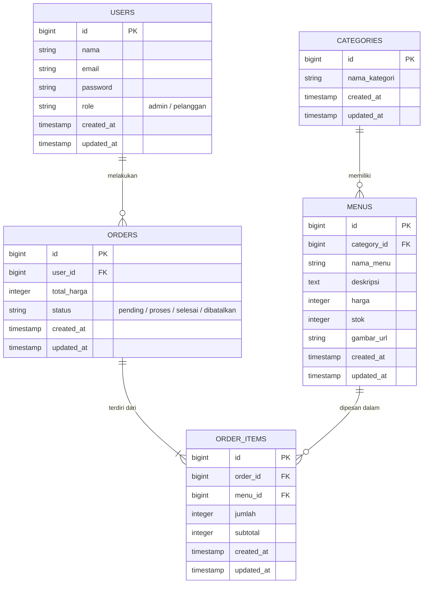

# Entity Relationship Diagram (ERD) SiKantin

Berikut adalah struktur final untuk database `sikantin`.

```mermaid
erDiagram
    USERS {
        bigint id PK
        string nama
        string email
        string password
        string role "admin / pelanggan"
        timestamp created_at
        timestamp updated_at
    }

    CATEGORIES {
        bigint id PK
        string nama_kategori
        timestamp created_at
        timestamp updated_at
    }

    MENUS {
        bigint id PK
        bigint category_id FK
        string nama_menu
        text deskripsi
        integer harga
        integer stok
        string gambar_url
        timestamp created_at
        timestamp updated_at
    }

    ORDERS {
        bigint id PK
        bigint user_id FK
        integer total_harga
        string status "pending / proses / selesai / dibatalkan"
        timestamp created_at
        timestamp updated_at
    }

    ORDER_ITEMS {
        bigint id PK
        bigint order_id FK
        bigint menu_id FK
        integer jumlah
        integer subtotal
        timestamp created_at
        timestamp updated_at
    }

    %% Relationships
    CATEGORIES ||--o{ MENUS : "memiliki"
    USERS ||--o{ ORDERS : "melakukan"
    ORDERS ||--|{ ORDER_ITEMS : "terdiri dari"
    MENUS ||--o{ ORDER_ITEMS : "dipesan dalam"
```
